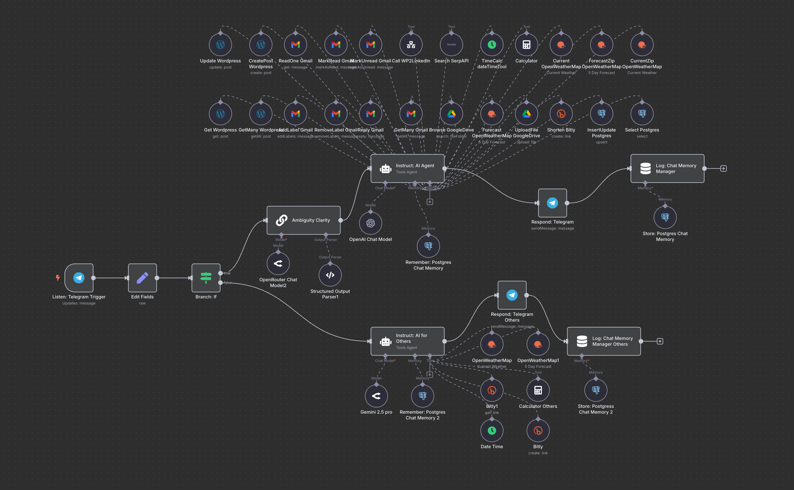

# n8n Telegram AI Agent

This repository contains a pre-configured n8n workflow for a Telegram-connected AI agent powered by LangChain. The workflow demonstrates how to receive Telegram messages, process them through an AI agent, integrate with external tools, and log contextual memory.

  
*The Telegram AI Agent workflow*


## 1. Overview

* **Workflow Name**: Simple Telegram AI Agent - v1
* **Primary Nodes**:

  * **Listen: Telegram Trigger**: Receives incoming Telegram messages.
  * **Edit Fields**: Prepares session metadata and message payload.
  * **Branch: If**: Filters messages from authorized users only.
  * **Ambiguity Clarity**: (Optional) Normalizes and enriches raw user input.
  * **Instruct: AI Agent**: Core LangChain agent that decides on tool usage and generates responses.
  * **Respond: Telegram**: Sends AI output back to the user.
  * **Memory Manager & Postgres Chat Memory**: Logs conversation history for context recall.

## 2. Installation & Setup

1. Clone this repo and navigate into it:

   ```bash
   git clone https://github.com/aporb/ipn-startup-resources.git
   cd ipn-startup-resources
   ```
2. Install n8n (if not already):

   ```bash
   npm install -g n8n
   ```
3. Start n8n:

   ```bash
   n8n start
   ```
4. Import the workflow JSON (`n8n-telegram-ai-agent-example.json`) via the n8n UI.
5. Configure credentials for Telegram, Postgres, and LangChain/OpenAI in the n8n **Credentials** section.

## 3. Configuration

* **Telegram Trigger**: Set your bot token and webhook URL.
* **Branch: If**: Replace `[MY_CHAT_ID]`, `[FIRST_NAME]`, `[LAST_NAME]` with your Telegram user details or switch to a dynamic user list stored in Postgres.
* **LangChain Agent**: Update the `systemMessage` and API keys. Adjust `maxIterations` or `temperature` as needed.
* **Postgres Memory**: Configure your Postgres connection and set a `contextWindowLength` for memory retention.

## 4. Workflow Breakdown

| Node Name                   | Purpose                                                                         |
| --------------------------- | ------------------------------------------------------------------------------- |
| Listen: Telegram Trigger    | Receives messages from Telegram and parses attachments.                         |
| Edit Fields                 | Sets up session ID, chat metadata, and prepares data for branching.             |
| Branch: If                  | Restricts processing to authorized user(s).                                     |
| Ambiguity Clarity           | (Optional) Clarifies ambiguous user input and enriches prompt for the AI agent. |
| Instruct: AI Agent          | Executes core AI logic, routes to tools (Calculator, Bitly, Weather, etc.).     |
| Respond: Telegram           | Sends back the AI-generated response via Telegram.                              |
| Log: Chat Memory Manager    | Inserts user + AI messages into a memory manager node for logging.              |
| Store: Postgres Chat Memory | Persists conversation context to Postgres for future retrieval.                 |

## 5. Usage

1. Send a message to your Telegram bot.
2. The workflow will:

   * Check authorization
   * Enrich input (if enabled)
   * Invoke AI agent to decide on tool actions
   * Call external tools as needed (e.g., calculator, weather)
   * Reply with formatted HTML content
   * Log interaction in memory
3. Retrieve conversation context by querying the Postgres table.

## 6. Contributing

Feel free to open issues or pull requests for enhancements. This workflow is designed to be a starting point for building advanced, tool-integrated AI agents in n8n.
